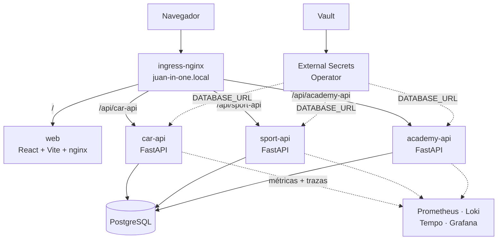
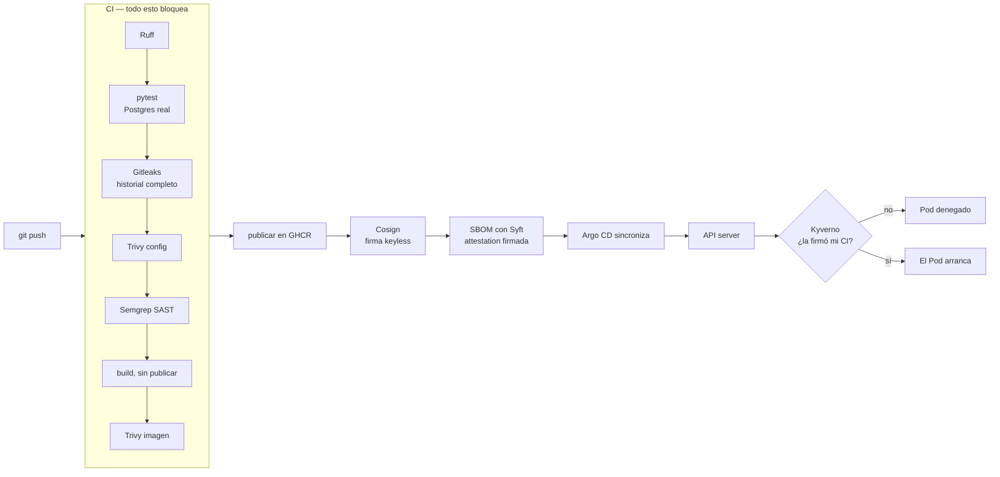

[English](README.md) · **Español**

# Juan in One

Una plataforma de Kubernetes con forma de producción, construida desde cero para aprender cada una de sus capas — desde el Dockerfile hasta el admission controller que decide si un Pod puede llegar a ejecutarse.

Tres microservicios en FastAPI y un front en React, entregados por GitOps, con una cadena de suministro que firma cada imagen y un clúster que se niega a ejecutar nada que no pueda verificar.


<p align="center">
  
</p>

---

## Por qué existe esto

Lo construí para aprender, y la forma del proyecto sale de ahí.

Las aplicaciones resuelven problemas reales míos — el mantenimiento de mi coche, mis carreras, mis certificaciones — porque quería algo que fuese a usar de verdad y no otra demo de lista de tareas. Pero **el código de aplicación es a propósito la parte menos cuidada**. Lo importante nunca fue el código, sino todo lo que hay alrededor.

Corre entero en mi propia máquina, en un clúster de un solo nodo sobre OrbStack. Dejar la nube fuera fue una decisión: en parte para no pagar por un proyecto de aprendizaje, y en parte porque quería montarlo todo sobre hardware que es mío y puedo destripar. Esa restricción es justamente el punto — aquí no hay ningún servicio gestionado que aparezca haciendo clic. **Cada pieza de esta plataforma es una que instalé, configuré y depuré yo**: el stack de monitorización desde cero con Prometheus, Grafana, Loki, Tempo, Alloy y OpenTelemetry; los secretos con Vault y External Secrets; la entrega con Argo CD; y las herramientas de seguridad a lo largo de toda la pipeline.

Lo que me propuse aprender: cómo se monta una pipeline de CI/CD y dónde va de verdad un gate; qué detecta y qué se le escapa a SAST, DAST, SCA, la detección de secretos y los SBOM; cómo se firma y se verifica una cadena de suministro de punta a punta; cómo se conectan realmente los tres pilares de la observabilidad; y cómo se comporta GitOps cuando algo falla. Casi todo lo que sé ahora salió de que las cosas se rompieran — y por eso las decisiones de más abajo están escritas como están.

---

## Arquitectura



Cada servicio tiene su propio chart de Helm. Cada chart es una `Application` de Argo CD. Cada `Application` está declarada en el repo [gitops](https://github.com/juan-in-one/gitops), gestionada por una única aplicación raíz — el patrón **App of Apps**, así que añadir un servicio es un `git push`, nunca un `kubectl apply`.

Un único host de ingress reparte por prefijo de ruta. El front siempre llama a URLs relativas (`/api/car-api/...`), lo que significa **cero CORS en ningún sitio**: en local, Vite proxya esas rutas hacia el clúster; en producción las enruta ingress-nginx. El código de React no distingue una situación de la otra, y no le hace falta.

<p align="center">
  
</p>

<p align="center"><i>Una única <code>Application</code> raíz gestiona todas las demás. Añadir un servicio es añadir un fichero a <code>apps/</code>.</i></p>


<p align="center"><i>La plataforma completa bajo Argo CD: las tres APIs, el front y la capa de plataforma que los sostiene.</i></p>

---

## Repositorios

| Repositorio | Qué es |
|---|---|
| [gitops](https://github.com/juan-in-one/gitops) | Las `Applications` de Argo CD y toda la capa de plataforma. La fuente de verdad del clúster. |
| [.github](https://github.com/juan-in-one/.github) | El workflow de CI reutilizable que comparten las tres APIs. |
| [car-api](https://github.com/juan-in-one/car-api) | Mantenimiento del coche — revisiones, ITV, kilómetros. |
| [sport-api](https://github.com/juan-in-one/sport-api) | Carreras y retos de montaña, conseguidos y pendientes. |
| [academy-api](https://github.com/juan-in-one/academy-api) | Certificaciones y objetivos diarios de estudio con check-ins. |
| [web](https://github.com/juan-in-one/web) | Front en React 19 + TypeScript para todo lo anterior. |

<table>
<tr>
<td width="33%"></td>
<td width="33%"></td>
<td width="33%"></td>
</tr>
</table>

<p align="center"><i>Las tres pantallas. El front es pequeño y sin alardes a propósito — existe para que la plataforma de debajo tenga algo real que entregar.</i></p>

---

## Cadena de suministro

Todas las imágenes recorren la misma pipeline, y el clúster verifica el resultado antes de ejecutar nada.



La firma es **keyless**: no hay ninguna clave privada guardada en ningún sitio. El job de CI demuestra su identidad ante Sigstore con un token OIDC de GitHub, Fulcio emite un certificado de diez minutos atado a esa identidad, y la firma queda registrada en el log público de transparencia Rekor. El clúster comprueba después que quien firmó fue exactamente ese workflow, desde `main`:

```yaml
subject: "https://github.com/juan-in-one/.github/.github/workflows/fastapi-service-ci.yml@refs/heads/main"
issuer:  "https://token.actions.githubusercontent.com"
```

Un atacante que robe un token del registro puede publicar una imagen. Lo que no puede es hacer que se ejecute.

<p align="center">
  
</p>

<p align="center"><i>Lint, tests y detección de secretos corren en paralelo; <code>build-and-push</code> solo arranca si los tres pasan. El DAST corre a la vez, contra la app levantada con un Postgres real.</i></p>


<p align="center"><i>Toda la cadena de suministro en un job, en orden. Fíjate en los pasos 8 al 12: la imagen se <b>construye sin publicar</b>, se escanea, y solo entonces se publica — así que un escaneo fallido significa que la imagen no llega siquiera al registro. Después se lee el digest real ya publicado, se firma, y el SBOM se adjunta como attestation firmada.</i></p>

Dos políticas vigilan la admisión, y entre las dos responden a las dos mitades de la pregunta — *de dónde viene esta imagen* y *quién la construyó*:


<p align="center"><i>Tres rechazos, en directo. <b>El primero</b>: una imagen mía, de un registro permitido, pero nunca firmada — la tumba la política de firmas. <b>El segundo y el tercero</b>: <code>ubuntu</code> y <code>mongo</code> de Docker Hub — los tumba la política de registros, antes siquiera de plantearse las firmas. Nada de fuera de los registros aprobados entra, y nada mío se ejecuta si no lo firmó mi CI.</i></p>

---

## Stack

| Capa | Herramientas |
|---|---|
| **Orquestación** | Kubernetes, Helm, ingress-nginx, metrics-server, HPA |
| **GitOps** | Argo CD, App of Apps, sync automático con prune y self-heal |
| **CI/CD** | Workflows reutilizables de GitHub Actions, GHCR |
| **Seguridad** | Ruff, Semgrep, Gitleaks, Trivy, OWASP ZAP, Cosign, Syft, Kyverno |
| **Secretos** | HashiCorp Vault, External Secrets Operator |
| **Observabilidad** | Prometheus, Loki, Tempo, Alloy, Grafana, OpenTelemetry |
| **Aplicaciones** | FastAPI, SQLAlchemy async, PostgreSQL, React 19, TypeScript, Vite |

### Observabilidad, montada desde cero


<p align="center"><i>Métricas RED por servicio — peticiones por segundo, porcentaje de errores y latencia p95 — junto a la salud de los pods. La carga de esta captura es sintética: peticiones y errores provocados a propósito para ejercitar los paneles y confirmar que cada uno reacciona a lo que dice medir. El selector de servicio cambia el dashboard entero entre car-api, sport-api y academy-api.</i></p>


<p align="center"><i>Logs en vivo desde Loki y trazas recientes desde Tempo, en el mismo dashboard. Junto a las métricas de infraestructura hay un contador de negocio propio, porque la pregunta interesante suele ser cuántos eventos de mantenimiento se han creado, no solo cuántas peticiones han entrado.</i></p>


<p align="center"><i>Una única petición a través de car-api, span a span: recepción HTTP, conexión, INSERT, SELECT, respuesta. OpenTelemetry instrumenta la app directamente, sin colector intermedio.</i></p>

---

## Decisiones de ingeniería

Lo interesante de este proyecto no es la lista de herramientas, sino por qué cada pieza está configurada como está.

<details>
<summary><b>El escaneo va antes del push, no después</b></summary>

El build usaba originalmente `push: true` y escaneaba a continuación. Eso parecía un gate de seguridad pero no lo era: para cuando Trivy hacía fallar el job, la imagen vulnerable ya estaba publicada en el registro y cualquiera podía descargarla. La pipeline se ponía roja; en realidad no se impedía nada.

Ahora el build corre con `push: false, load: true`, manteniendo la imagen dentro del runner mientras se escanea, y publica en un paso aparte solo si todo ha pasado. Un gate que avisa de la brecha cuando ya ha ocurrido es un informe, no un gate.
</details>

<details>
<summary><b>Bloquear solo por vulnerabilidades que se pueden arreglar</b></summary>

Trivy hace fallar el build ante CRITICAL y HIGH, pero con `ignore-unfixed`. Bloquear por una CVE sin parche disponible no hace nada más seguro — deja la pipeline en rojo permanente hasta que alguien desactiva el escáner, que es peor que no tenerlo.

La vez que esto importó de verdad: tres CVEs CRITICAL sin arreglo en `perl-base`, que venía en la imagen base slim de Debian y que ninguna de estas apps usa para nada. En vez de silenciarlas o esperar a Debian, el paquete se elimina de la imagen. El código que no está en la imagen no se puede explotar.
</details>

<details>
<summary><b>La identidad que firma es el workflow reutilizable, no quien lo llama</b></summary>

Las tres APIs comparten un workflow reutilizable. Fulcio saca la identidad del certificado del claim OIDC `job_workflow_ref` — el workflow que contiene físicamente el job que se está ejecutando — así que las tres firman como `.github/.github/workflows/fastapi-service-ci.yml`, no como su propio `ci.yml`.

El front tiene su propio workflow, así que firma con una identidad distinta. Por eso la política de Kyverno declara dos attestors, y cualquier servicio futuro que adopte el workflow compartido se acepta sin tocar la política.

`id-token: write` hay que concederlo dos veces, en el workflow que llama y en el reutilizable: quien llama pone el techo, y el bloque `permissions` explícito del llamado filtra sobre él.
</details>

<details>
<summary><b>El motor legacy de Kyverno no veía firmas válidas</b></summary>

La primera implementación usaba una `ClusterPolicy` (`kyverno.io/v1`), que insistía en reportar `no signatures found` para imágenes cuyas firmas se verificaban perfectamente a mano con `cosign verify` y `crane ls`, usando las mismas credenciales.

El diagnóstico salió de los logs del admission controller, más verificar el token del registro por separado para descartarlo. La solución fue migrar a `ImageValidatingPolicy` (`policies.kyverno.io`), el motor basado en CEL que el propio Kyverno recomienda en sus avisos de deprecación. Funcionó a la primera.

Llegar hasta ahí exigió además tres intentos de autenticación contra el registro: RBAC sobre los `imagePullSecrets` existentes, luego referencias explícitas al secreto entre namespaces — que fallan por un bug conocido de Kyverno — y por último un secreto en el propio namespace `kyverno`.
</details>

<details>
<summary><b>La mutación del digest está desactivada a propósito</b></summary>

El motor CEL activa `mutateDigest` por defecto, reescribiendo la imagen del Deployment a su digest resuelto en el momento de la admisión. Es una funcionalidad genuinamente útil — y dejó a car-api en `OutOfSync` permanente sin un solo commit en el repo de GitOps, porque Git decía `sha-61c886a` y el clúster decía `@sha256:...`.

Está desactivada, con el motivo anotado al lado. Dos buenas prácticas en conflicto directo, resuelto a favor de la coherencia de GitOps; el problema de los tags mutables se ataja desplegando tags inmutables por commit.
</details>

<details>
<summary><b>Server-side apply, e ignorar solo las diferencias reales</b></summary>

Los CRDs de Kyverno llevan dentro todo su esquema de validación, lo que desborda la anotación de 256 KB que el `kubectl apply` de cliente usa para guardar la configuración anterior. `ServerSideApply=true` mueve esa contabilidad al API server.

Las dos diferencias que quedaban eran artefactos de serialización, no desviaciones reales: `spec.conversion`, que el API server rellena por defecto con `{strategy: None}`, y un mapa vacío `labels: {}` que Kubernetes omite por completo. Ambas se verificaron campo a campo con `argocd app diff` antes de añadirlas a `ignoreDifferences` — nunca a ciegas.
</details>

---

*Construido y mantenido por [Juan Álvarez Gayoso](https://github.com/juan-cloudops) — Cloud & DevOps Engineer.*
