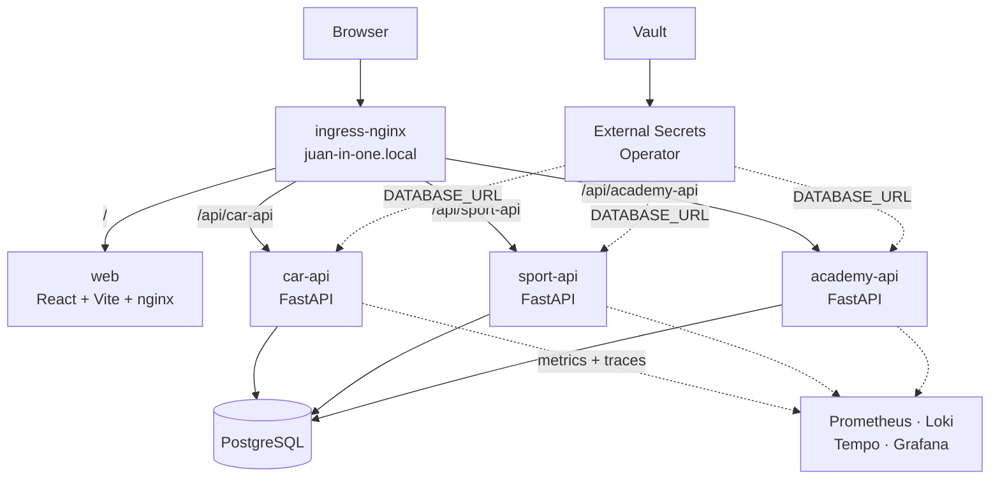
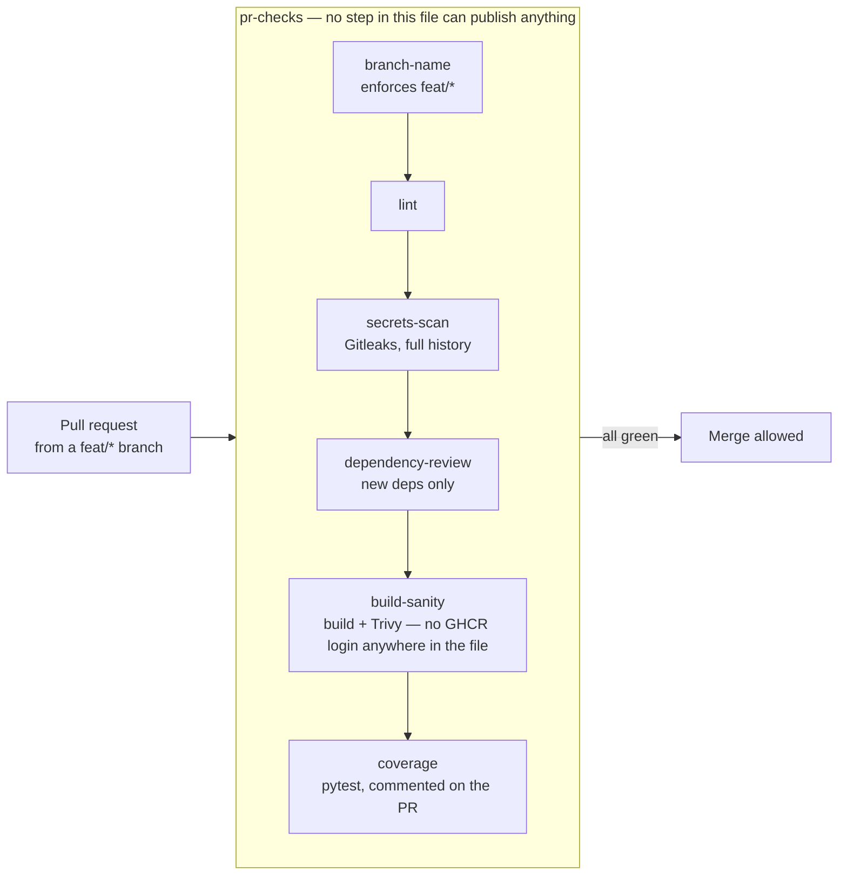
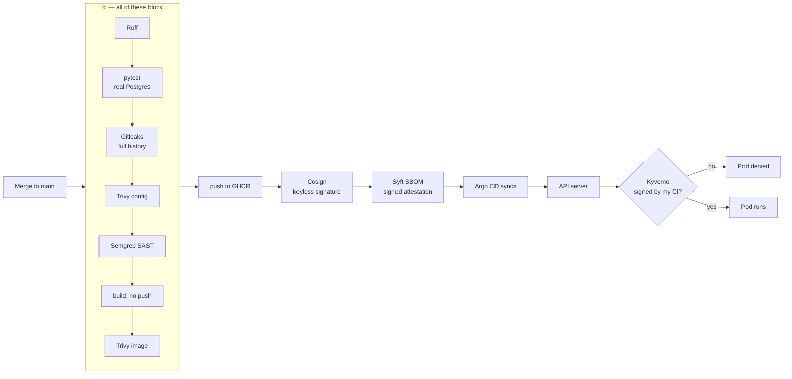

**English** · [Español](README.es.md)

# Juan in One

A production-shaped Kubernetes platform, built from scratch to learn every layer of it — from the Dockerfile to the admission controller that decides whether a Pod is allowed to run.

Three FastAPI microservices and a React front end, delivered by GitOps, with a supply chain that signs every image and a cluster that refuses to run anything it cannot verify.


<p align="center">
  
</p>

---

## Why this exists

I built this to learn, and the shape of the project follows from that.

The applications solve real problems of mine — my car's servicing, my races, my certifications — because I wanted something I would actually use rather than another to-do list demo. But **the application code is deliberately the least polished part**. The point was never the code; it was everything around it.

It runs entirely on my own machine, on a single-node OrbStack cluster. Leaving the cloud out was deliberate: partly to keep a learning project off a cloud bill, and partly because I wanted the whole thing on hardware I own and can take apart. That constraint is the point — nothing here is a managed service I clicked into existence. **Every piece of this platform is one I installed, configured and debugged myself**: the monitoring stack from zero with Prometheus, Grafana, Loki, Tempo, Alloy and OpenTelemetry; secrets with Vault and External Secrets; delivery with Argo CD; the security tooling across the whole pipeline.

What I set out to learn: how a CI/CD pipeline is put together and where a gate genuinely belongs; what SAST, DAST, SCA, secret scanning and SBOMs each catch and what they miss; how a software supply chain is signed and verified end to end; how the three pillars of observability actually get wired up; and how GitOps behaves when something goes wrong. Most of what I know now came from things breaking — which is why the decisions below are written up the way they are.

---

## Architecture



Every service is a Helm chart of its own. Every chart is an Argo CD `Application`. Every `Application` is declared in the [gitops](https://github.com/juan-in-one/gitops) repo, managed by a single root app — the **App of Apps** pattern, so adding a service is a `git push`, never a `kubectl apply`.

A single ingress host fans out by path prefix. The front end only ever calls relative URLs (`/api/car-api/...`), which means **no CORS anywhere** — in local development Vite proxies those paths to the cluster, and in production ingress-nginx routes them. The React code cannot tell the difference, and does not need to.


<p align="center">
  
</p>

<p align="center"><i>One root <code>Application</code> owns every other one. Adding a service means adding a file to <code>apps/</code>.</i></p>


<p align="center"><i>The full platform under Argo CD: three APIs, the front end, and the platform layer that supports them.</i></p>

---

## Access

Everything is served by a single ingress-nginx host, resolved locally through `/etc/hosts`:

```
<INGRESS_IP>  juan-in-one.local
<INGRESS_IP>  argocd.juan-in-one.local
```

`<INGRESS_IP>` is the address OrbStack assigns to the ingress-nginx LoadBalancer — `kubectl get svc -n ingress-nginx` returns it.


<p align="center"><i>The same address in both places: the <code>EXTERNAL-IP</code> of the ingress-nginx Service, and the two <code>/etc/hosts</code> entries that point the local domains at it.</i></p>

| URL | What it serves |
|---|---|
| `http://juan-in-one.local/` | The front end |
| `http://juan-in-one.local/api/car-api/` | car-api |
| `http://juan-in-one.local/api/sport-api/` | sport-api |
| `http://juan-in-one.local/api/academy-api/` | academy-api |
| `http://juan-in-one.local/grafana/` | Grafana |
| `http://argocd.juan-in-one.local/` | Argo CD |

The applications share one host and fan out by path prefix, which is what keeps the front end on relative URLs and out of CORS entirely. Argo CD gets its own subdomain because it is platform tooling, not part of the product.

---

## Repositories

| Repository | What it is |
|---|---|
| [gitops](https://github.com/juan-in-one/gitops) | Argo CD `Applications` and the whole platform layer. The source of truth for the cluster. |
| [.github](https://github.com/juan-in-one/.github) | The reusable CI workflow shared by all three APIs. |
| [car-api](https://github.com/juan-in-one/car-api) | Vehicle maintenance — services, inspections, mileage. |
| [sport-api](https://github.com/juan-in-one/sport-api) | Races and mountain challenges, done and pending. |
| [academy-api](https://github.com/juan-in-one/academy-api) | Certifications and daily study goals with check-ins. |
| [web](https://github.com/juan-in-one/web) | React 19 + TypeScript front end for all of the above. |

<table>
<tr>
<td width="33%"></td>
<td width="33%"></td>
<td width="33%"></td>
</tr>
</table>

<p align="center"><i>The three screens. The front end is small and unshowy on purpose — it exists so the platform underneath has something real to deliver.</i></p>

---

## Supply chain

Two workflows, and they never run at the same time. Opening a PR validates it; only a merge to `main` can publish anything.



Merging is the only thing that triggers the real delivery pipeline:



The signature is **keyless**: no private key is stored anywhere. The CI job proves its identity to Sigstore with a GitHub OIDC token, Fulcio issues a ten-minute certificate bound to that identity, and the signature is recorded in the Rekor public transparency log. The cluster then checks that the signer was this exact workflow, on `main`:

```yaml
subject: "https://github.com/juan-in-one/.github/.github/workflows/fastapi-service-ci.yml@refs/heads/main"
issuer:  "https://token.actions.githubusercontent.com"
```

An attacker who steals a registry token can still push an image. They cannot make it run.

<p align="center">
  
</p>

<p align="center"><i>The <code>ci</code> job graph, on merge to <code>main</code>: lint, tests and secret scanning run in parallel; <code>build-and-push</code> starts only if all three pass. DAST runs alongside, against the app booted with a real Postgres.</i></p>


<p align="center"><i>The whole supply chain in one job, in order. Note steps 8 to 12: the image is <b>built without publishing</b>, scanned, and only then pushed — so a failed scan means the image never reaches the registry at all. Then the real digest is read back from the registry, signed, and the SBOM is attached as a signed attestation.</i></p>

Two policies guard admission, and between them they answer both halves of the question — *where did this image come from*, and *who built it*:


<p align="center"><i>Three refusals, live. <b>First</b>: one of my own images, from an allowed registry, but never signed — rejected by the signature policy. <b>Second and third</b>: <code>ubuntu</code> and <code>mongo</code> from Docker Hub — rejected by the registry policy before signatures are even considered. Nothing from outside the approved registries gets in, and nothing of mine runs unless my CI signed it.</i></p>

---

## Stack

| Layer | Tools |
|---|---|
| **Orchestration** | Kubernetes, Helm, ingress-nginx, metrics-server, HPA |
| **GitOps** | Argo CD, App of Apps, automated sync with prune and self-heal |
| **CI/CD** | GitHub Actions reusable workflows, GHCR |
| **Security** | Ruff, Semgrep, Gitleaks, Trivy, OWASP ZAP, Cosign, Syft, Kyverno |
| **Secrets** | HashiCorp Vault, External Secrets Operator |
| **Observability** | Prometheus, Loki, Tempo, Alloy, Grafana, OpenTelemetry |
| **Applications** | FastAPI, SQLAlchemy async, PostgreSQL, React 19, TypeScript, Vite |


### Observability, built from scratch


<p align="center"><i>RED metrics per service — request rate, error percentage and p95 latency — next to pod health. The load in this capture is synthetic: requests and deliberate error responses generated to exercise the panels and confirm each one reacts to what it claims to measure. The service selector switches the whole dashboard between car-api, sport-api and academy-api.</i></p>


<p align="center"><i>Live logs from Loki and recent traces from Tempo, on the same dashboard. A custom business counter sits alongside the infrastructure metrics, because the interesting question is usually how many maintenance events were created, not just how many requests came in.</i></p>


<p align="center"><i>A single request through car-api, span by span: HTTP receive, connection, INSERT, SELECT, response. OpenTelemetry instruments the app directly, with no intermediate collector.</i></p>

---

## Engineering decisions

The interesting part of this project is not the tool list — it is why each piece is configured the way it is.

<details>
<summary><b>Scanning happens before the push, not after</b></summary>

The build originally used `push: true` and scanned afterwards. That looked like a security gate but was not one: by the time Trivy failed the job, the vulnerable image was already public in the registry and anyone could pull it. The pipeline turned red; nothing was actually prevented.

The build now runs with `push: false, load: true`, keeping the image inside the runner while it is scanned, and pushes in a separate step only if everything passed. A gate that reports a breach after the fact is a report, not a gate.
</details>

<details>
<summary><b>Blocking only on vulnerabilities that can actually be fixed</b></summary>

Trivy fails the build on CRITICAL and HIGH, but with `ignore-unfixed`. Blocking on a CVE with no patch available does not make anything safer — it leaves the pipeline permanently red until someone disables the scanner, which is worse than not having one.

The one time this mattered: three unfixable CRITICAL CVEs in `perl-base`, shipped by the Debian slim base image and used by nothing in these apps. Rather than suppress them or wait for Debian, the package is removed from the image. Code that is not in the image cannot be exploited.
</details>

<details>
<summary><b>The signing identity is the reusable workflow, not the caller</b></summary>

The three APIs share one reusable workflow. Fulcio derives the certificate identity from the OIDC `job_workflow_ref` claim — the workflow that physically contains the running job — so all three sign as `.github/.github/workflows/fastapi-service-ci.yml`, not as their own `ci.yml`.

The front end has its own workflow, so it signs under a different identity. The Kyverno policy therefore declares two attestors, and any future service adopting the shared workflow is accepted with no policy change.

`id-token: write` has to be granted twice, in both the calling workflow and the reusable one: the caller sets the ceiling, and the callee's explicit `permissions` block filters it.
</details>

<details>
<summary><b>The legacy Kyverno engine could not see valid signatures</b></summary>

The first implementation used a `ClusterPolicy` (`kyverno.io/v1`), which kept reporting `no signatures found` for images whose signatures verified correctly by hand with `cosign verify` and `crane ls`, using the same credentials.

Diagnosis came from the admission controller logs plus verifying the registry token separately to rule it out. The fix was migrating to `ImageValidatingPolicy` (`policies.kyverno.io`), the CEL-based engine Kyverno recommends in its own deprecation notices. It worked on the first try.

Getting there also required three attempts at registry authentication: RBAC on the existing `imagePullSecrets`, then explicit cross-namespace secret references — which fail due to a known Kyverno bug — and finally a secret in the `kyverno` namespace itself.
</details>

<details>
<summary><b>Digest mutation is disabled on purpose</b></summary>

The CEL engine enables `mutateDigest` by default, rewriting the Deployment's image to its resolved digest at admission time. That is a genuinely useful feature — and it put car-api into permanent `OutOfSync` without a single commit to the GitOps repo, because Git said `sha-61c886a` and the cluster said `@sha256:...`.

It is switched off, with the reason recorded next to it. Two good practices in direct conflict, resolved in favour of GitOps consistency; mutable tags are handled instead by deploying immutable per-commit tags.
</details>

<details>
<summary><b>PR-time and merge-time are two separate files, not one workflow with an <code>if</code></b></summary>

The first version had one reusable workflow listening to both `push` and `pull_request`, with the publish/sign steps gated behind `if: github.event_name == 'push'`. It worked, but every PR page showed a job called `ci` that could never actually publish anything — confusing, and it duplicated what a dedicated PR-checks job already covered.

`ci.yml` now triggers only on push to `main`; `pr-checks.yml` only on `pull_request`. Verified with a real PR (only `pr-checks` runs, `ci` shows as `skipping`) and a real merge straight after (the reverse, `pr-checks` shows as `skipped`). `pr-checks` absorbed lint, Gitleaks and a build-and-scan sanity job with no GHCR login step anywhere in the file — not disabled by a condition, structurally unable to publish.

Wiring up the PR-time coverage job surfaced three unrelated real bugs, in order: `python-coverage-comment-action` needs `contents: write`, not just `pull-requests: write`, to store its history on an orphan branch — the error it throws for this is a generic, misleading "permissions" message; `coverage.py` needs `relative_files = true` in `pyproject.toml` or the action cannot read its own report; and GitHub's Dependency Review Action needs `vulnerability-alerts` explicitly enabled per repository — not bundled with making a repo public, and not the same setting as Secret Scanning or Dependabot updates.
</details>

<details>
<summary><b>Server-side apply, and only the diffs that are real</b></summary>

Kyverno's CRDs embed their full validation schema, which overflows the 256 KB annotation that client-side `kubectl apply` uses to store the previous configuration. `ServerSideApply=true` moves that bookkeeping to the API server.

Two remaining diffs were serialisation artefacts, not real drift: `spec.conversion`, which the API server defaults to `{strategy: None}`, and an empty `labels: {}` map that Kubernetes drops entirely. Both were verified field by field with `argocd app diff` before being added to `ignoreDifferences` — never ignored blindly.
</details>

---

*Built and maintained by [Juan Álvarez Gayoso](https://github.com/juan-cloudops) — Cloud & DevOps Engineer.*
